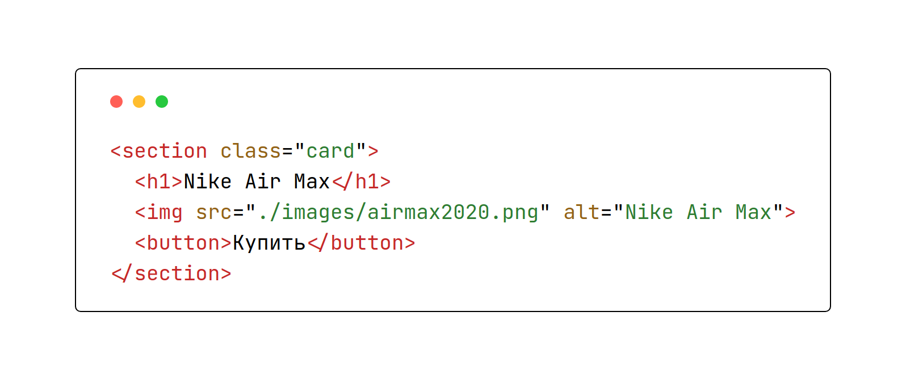
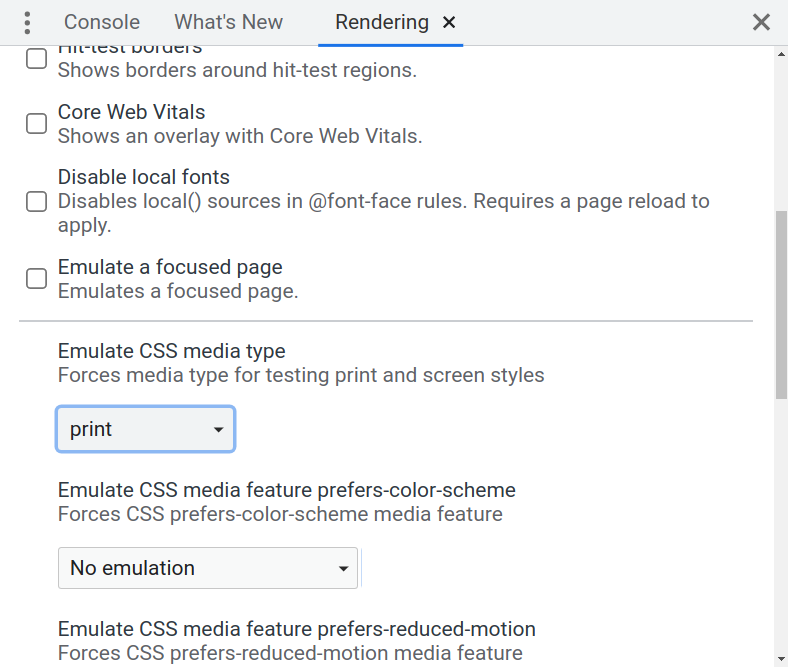

# Медиазапросы и другие устройства

Создайте версию терминала для печати на принтере. В отличие от множества экранов, для печати стараются делать минималистичный дизайн с простыми цветами и отсутствием фона. Сейчас уже свёрстан терминал для вывода на экраны устройств.

Основные цвета находятся в файле `variables.css`. Этот файл является единым для всех версий, поэтому вы можете перезаписать переменные по необходимости

В чём различия обычной версии и версии для печати. Опишем стили для вывода на печать:

- Фон страницы: `#fff`
- Фон терминала: отсутствует или `#fff`
- У терминала появляется сплошная граница шириной в *1px* и цветом `#000`
- Основной цвет текста в терминале: `#000`
- Так же меняются цвета выделения тегов, атрибутов и их значений. Это связано с изменением контраста фона и цветом этих элементов:
    - Цвет тега: `#c62828`
    - Цвет атрибута: `#936315`
    - Цвет значения атрибута: `#2e7d32`

После применения всех действий терминал для печати будет выглядеть так:

## Как проверять стили для печати

Если вы используете Chrome DevTools, то вам доступен режим эмуляции различных *media type*. Чтобы его включить:

1. Откройте DevTools
2. Воспользуйтесь комбинацией <kbd>Ctrl + Shift + P</kbd>
3. Выберите пункт *Show Rendering*
В появившейся вкладке меняйте значение поля *Emulate CSS media type*

